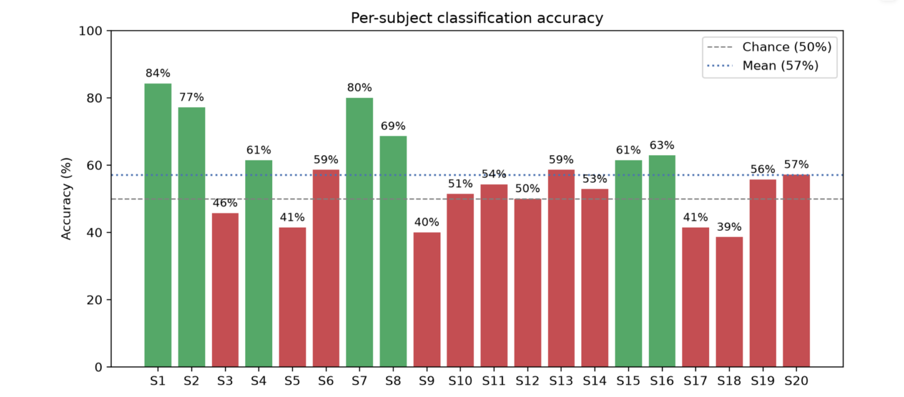

# 🧠 EEG Motor Imagery Classifier

A full-stack machine-learning project that reads brain signals (EEG) and predicts whether a person **imagined moving their left hand or right hand** — a simple brain-computer interface (BCI) demo, with an interactive web app.

Built as a learning project combining IT/coding with real neuroscience data. No prior neuroscience background needed.

---

## The idea, in one line

When you *imagine* moving your left or right hand, your brain produces slightly different electrical patterns — even without any real movement. This project trains a classifier to tell those two patterns apart from EEG recordings, the same core idea behind brain-computer interfaces that let people control devices by thought.

---

## Interactive web app

The project includes a [Streamlit](https://streamlit.io/) web app. Pick a subject, click **Run pipeline**, and it loads real EEG data, trains a classifier, and shows the results live in your browser — accuracy, raw brain signal, band-power comparison, and a confusion matrix.

```bash
streamlit run app.py
```

It also has a **Compare across subjects** feature that runs the classifier on many people and charts each one's accuracy — which leads to the project's main finding below.

---

## Main finding: accuracy varies hugely between people

Running the classifier across 20 different subjects shows something important:



Accuracy ranges from **39%** (subject 18) to **84%** (subject 1), averaging **57%** — only slightly above the 50% chance line. Some people (green bars) produce clear, easily-decodable motor-imagery signals; others (red bars) sit at or below chance.

This spread is expected and well-documented: roughly **15–30% of people** produce motor-imagery signals that are hard to decode, a known effect sometimes called **"BCI illiteracy."** It's a reminder that reporting a single subject's accuracy can be misleading, and that testing across people matters.

> To reproduce: open the app, set the "Compare" slider to 20, and click **Compare subjects**.

---

## How it works

1. **Loads** real EEG recordings of people imagining left/right hand movement (PhysioNet EEG Motor Movement/Imagery dataset, downloaded automatically).
2. **Preprocesses** the signal — band-pass filtering (1-45 Hz) and common-average referencing.
3. **Slices** the recording into labelled 4-second clips, one per imagined movement.
4. **Extracts features** — average power in five frequency bands (Delta, Theta, Alpha, Beta, Gamma) for every EEG channel.
5. **Trains a classifier** (Support Vector Machine) to separate left from right.
6. **Evaluates** on unseen clips, averaging over several random splits for an honest accuracy estimate.

The key neuroscience: imagining hand movement causes *Event-Related Desynchronization* — a drop in alpha/beta power over the motor cortex on the side opposite the imagined hand. The band-power features are designed to capture that.

---

## Project structure

```
eeg-motor-imagery-classifier/
├── app.py                # Streamlit web app (the main interface)
├── src/
│   ├── preprocess.py     # Load data, filter, epoch, extract features
│   ├── classify.py       # Train & evaluate classifiers (CLI version)
│   └── visualize.py      # Plot raw EEG, PSD, band power (CLI version)
├── requirements.txt
└── README.md
```

(The `data/` and `results/` folders are created automatically when you run it.)

---

## Setup & run

```bash
# 1. Clone the repo
git clone https://github.com/apoorvarrshetty/eeg-motor-imagery-classifier
cd eeg-motor-imagery-classifier

# 2. Create a virtual environment
python -m venv venv
venv\Scripts\activate          # Windows
# source venv/bin/activate     # macOS/Linux

# 3. Install dependencies
pip install -r requirements.txt

# 4. Launch the web app
streamlit run app.py
```

The EEG dataset (~7 MB per subject) downloads automatically on first run, then is cached locally.

**Prefer the command line?** You can also run the pipeline without the web app:
```bash
python src/visualize.py     # generate EEG plots
python src/classify.py      # train classifiers and print accuracy
```

---

## Tech stack

`Python` · `Streamlit` · `MNE-Python` · `scikit-learn` · `NumPy` · `SciPy` · `Matplotlib`

---

## Dataset

**PhysioNet EEG Motor Movement/Imagery Dataset (BCI2000)** — 109 subjects, runs of left/right hand motor imagery. Downloaded automatically via `mne.datasets.eegbci`. License: Open Data Commons Attribution License.

---

## Notes

This is a learning project built with AI assistance. The classifier, web app, and the multi-subject comparison feature were developed and debugged hands-on, and the BCI-illiteracy finding came from actually running the comparison across subjects and interpreting the spread.
